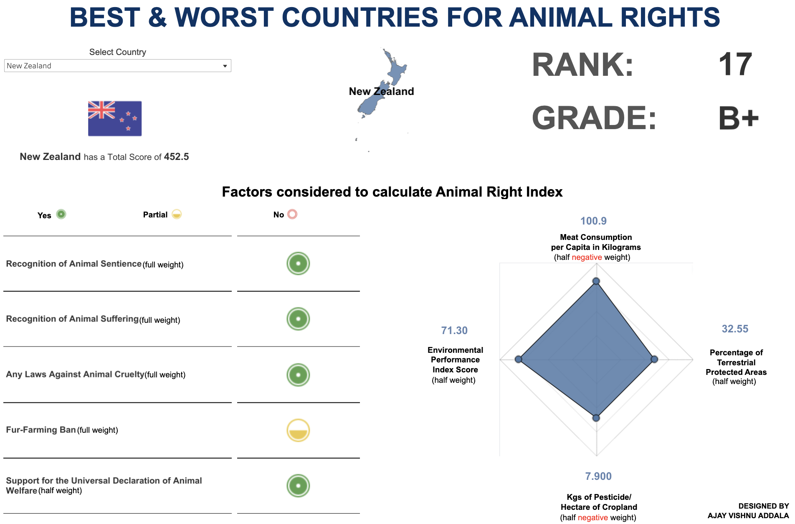

# Animal Rights Index Visualization

Welcome to the Animal Rights Index Visualization repository! This project was created as part of the Makeover Monday 2024 Week 9 Challenge.

## Overview

Animal rights laws vary greatly worldwide, and this visualization aims to showcase how different countries perform regarding animal rights and welfare. We gathered statistics from key international data sources to create a comprehensive "Animal Rights Index," which helps identify which countries are the best and worst regarding animal rights.

## Tableau Visualization

You'll find a Tableau workbook file containing the visualization in this repository. The dashboard allows users to select a country from the dropdown menu. Key performance indicators (KPIs) such as Rank, Grade, Score, and other details from the dataset will be showcased accordingly.

## Dataset

The dataset used for this visualization is available. It includes information on various factors related to animal rights and welfare, such as recognition of animal sentience, laws against animal cruelty, fur-farming bans, meat consumption per capita, percentage of protected areas, and more.

## Demonstration Video

A demonstration video is provided in the repository to help users understand how to interact with the visualization and explore the data. This video analyses the dashboard's features and demonstrates how users can select different countries and view corresponding KPIs.

## Usage

To explore the visualization and dataset:

1. Download or clone this repository to your local machine.
2. Open the twbx file using Tableau Desktop or Tableau Public.
3. Interact with the dashboard by selecting different countries from the dropdown menu.
4. Refer to the demonstration video for further guidance.

## Contributing

Feel free to fork the repository, make changes, and submit a pull request if you'd like to contribute to this project. Suggestions for improving the visualization, adding new features, or enhancing the dataset are welcome!

Happy exploring!
